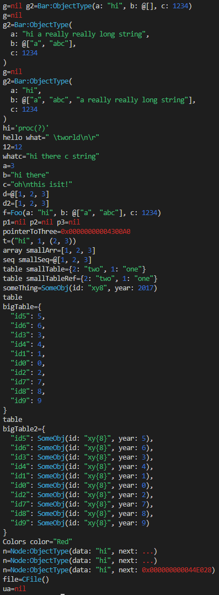

# Print - a better echo.

Use `print` how you would use `echo` for print-debugging, it prints objects the "nim way" with syntax highlighting. Even with refs, pointers, or cycles!

```nim
import print

let a = 3
print a
```
```nim
a = 3
```

## The "nim way"

It prints data structures in a way you would create them in nim source code. Ideally you can take what it prints out and just copy paste that into code again and it should compile in many of the cases.

```nim
let
  a = 3
  b = "hi there"
  c = "oh\nthis\0isit!"
  d = @[1, 2, 3]
  d2 = [1, 2, 3]
  f = Foo(a:"hi", b:@["a", "abc"], c:1234)

print a, b, c, d, d2, f
```
```nim
a=3 b="hi there" c="oh\nthis\0isit!" d=@[1, 2, 3] d2=[1, 2, 3] f=Foo(a:"hi", b:@["a", "abc"], c:1234)
```

## Syntax highlighting

Screenshot from VS Code:



If you are piping to a file it will not detect a terminal and give you plain ascii instead.

## Smart Indention

It will try to print out everything in one line, but it if it does not fit it will create indentation levels. Max width is based on current terminal max width.

```nim
g2 = Bar(a: "hi a really really long string", b: @["a", "abc"], c: 1234)
print g2
```

## Stuff `echo` does not do well

It will also print `nil`s, `ref`s, and `pointer`s.

```nim
g2=Bar(
  a: "hi a really really long string",
  b: @["a", "abc"],
  c: 1234
)
```

```nim
let
  p1: ptr int = nil
  p2: ref Foo = nil
print p1, p2
```
```nim
p1=nil p2=nil
```

```nim
var three = 3
var pointerToThree = cast[pointer](addr three)
print pointerToThree
```
```nim
pointerToThree=0x00000000004360A0
```

## And even cycles!

It will also stop recursing repeating structures:
```nim
type Node = ref object
  data: string
  next: Node
var n = Node(data:"hi")
n.next = n
print n
```
```nim
n=Node(data: "hi", next: ...)
```
